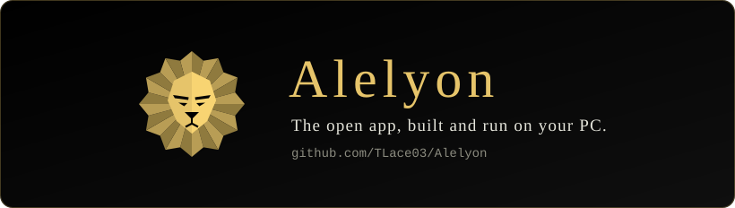
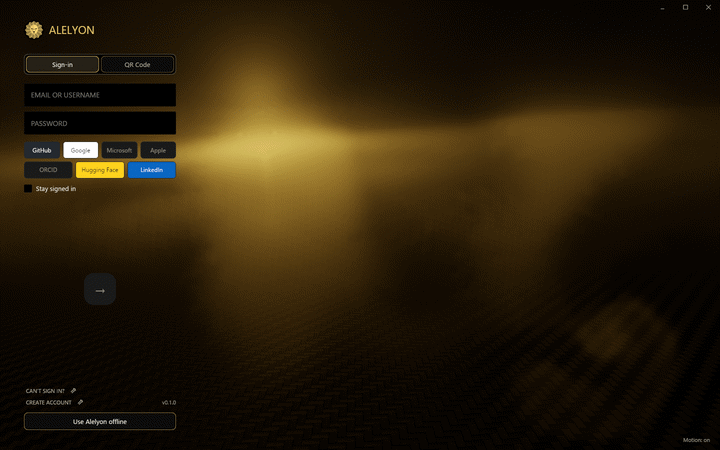
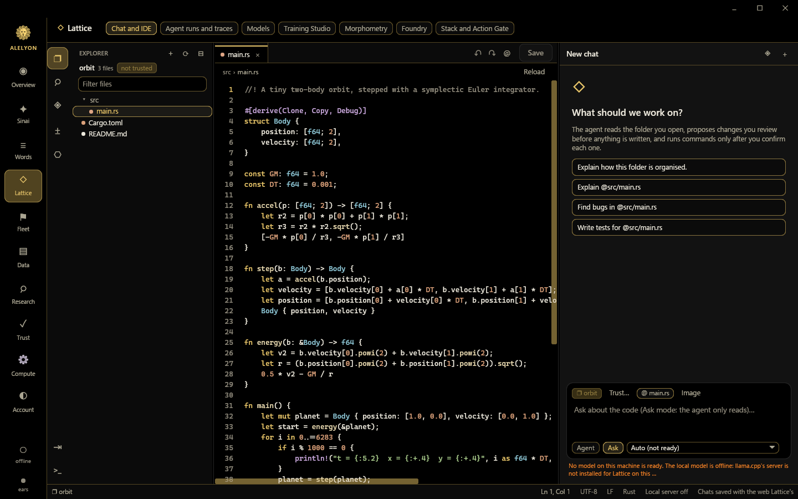
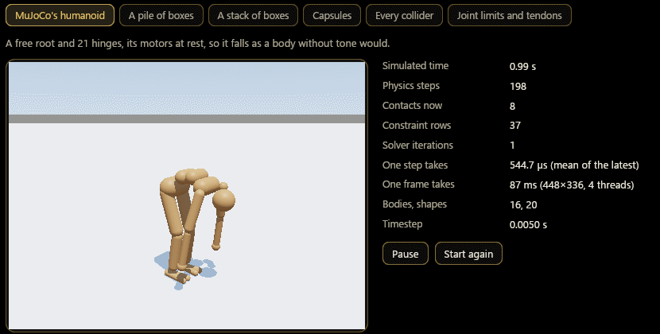
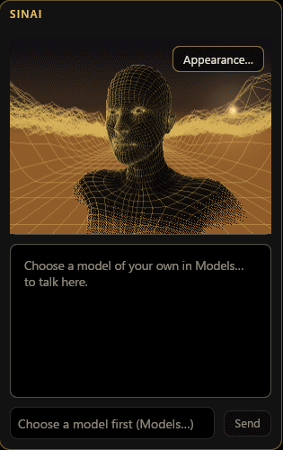
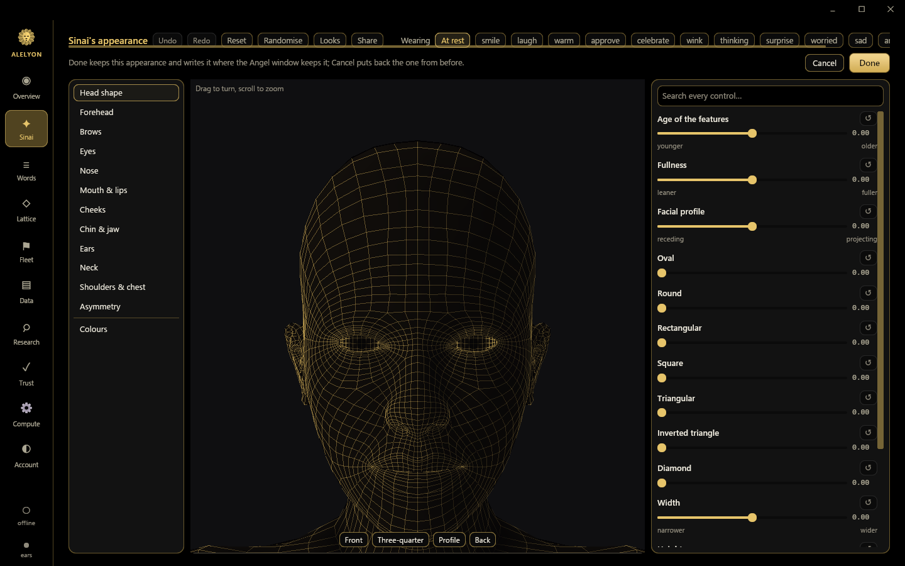

<div align="center">



<p>
  <a href="https://github.com/TLace03/Alelyon/blob/main/LICENSE"></a>
  <a href="https://github.com/TLace03/Alelyon-Client"></a>
  <a href="https://github.com/TLace03/Alelyon-OS"></a>
  
</p>

<b>One window for an AI that lives on your own computer.</b>

</div>

Alelyon is a desktop app. In one black-and-gold window it brings together **Sinai**, a
face you talk to that answers with a model of your own; **Lattice**, a chat and coding
agent with its own editor; a **physics simulator** you can watch step by step; a
**research archive** that follows a subject's papers through their citations; and
**receipts**, numbers that carry the evidence of how they were computed. It runs on your
PC: nothing you say, type or open leaves it unless you send it somewhere yourself.

This repository is where the open parts come together into that app, built and run
locally with no servers. It is assembled from the module repositories listed below.

## A look around

<table>
  <tr>
    <td width="50%" valign="top">
      <br>
      <b>Sign-in.</b> A gold fog that moves under your pointer. Signing in is optional:
      <i>Use Alelyon offline</i> opens everything that runs on this PC.
    </td>
    <td width="50%" valign="top">
      <br>
      <b>Lattice.</b> A folder in the explorer, the editor, and the agent beside them. The
      agent reads the folder you open, proposes changes you review before anything is
      written, and runs commands only after you confirm each one.
    </td>
  </tr>
  <tr>
    <td width="50%" valign="top">
      <br>
      <b>The simulator.</b> MuJoCo's humanoid, its motors at rest, falling as a body
      without tone would: the physics runs on the processor and every step is counted.
    </td>
    <td width="50%" valign="top">
      
      <br>
      <b>Sinai.</b> Its face, drawn live, and the appearance creator that shapes it. Choose a
      model of your own (a GGUF file run on this PC, or an endpoint you use) and Sinai
      answers with it.
    </td>
  </tr>
</table>

Every image here was taken from the open build, on a fresh profile, with demonstration
data and no account.

## What the open app holds

| Part | What you get |
|---|---|
| The app shell | The window and its title bar, sign-in, the gold-fog backdrop, Settings, and the Overview, Words, Data and Trust pages. |
| Lattice | The chat and coding agent with its IDE: explorer, editor, search, a terminal, staged changes with a review, and a policy that allows, asks or refuses each tool call. |
| Sinai | Its face and its page, with a model of your own. |
| The simulator | A scene importer for MuJoCo's MJCF files and a CPU physics core ported from MuJoCo, held to it by golden files. |
| Measurement and training | Lattice's measurement engine and the Training Studio. |
| The research archive | Subjects, their papers, the citation map and the gaps worth pursuing, kept on this PC. |

## Build and run it locally

The app's own source joins this repository once its window builds from open code alone;
that is the next step of opening it, and until it lands this repository carries no build
that does not work. The open modules it is assembled from build, test and run on their own
today, from [Alelyon-Client](https://github.com/TLace03/Alelyon-Client) (Windows, Rust 1.97
or later):

```bash
git clone https://github.com/TLace03/Alelyon-Client
cd Alelyon-Client
(cd lattice && cargo run --release --locked -p lattice-app -- --demo)   # Lattice's window, demonstration data
(cd sim && cargo test --locked --workspace)                             # the simulator's physics and importer
(cd crates/sinai-face && cargo test --locked)                           # Sinai's face: bust, expressions, shaders
```

When the app lands, its modules will sit in this repository as copies taken from the same
source revision as the app, so one `UPSTREAM.json` names the whole tree and a build needs
nothing fetched from another repository, no server and no account.

## What the live package adds

Some of Alelyon runs on Alelyon's servers rather than on your PC. **Friends** (your
friends list, presence and one-to-one chat, following your account wherever you sign
in) is one of them. Access to that is gained via installing the live package. The live
package is the official Alelyon app: it also carries the parts that are not open, which
arrive in it as plug-ins. A page whose part is not in the build you are running says so,
what the part is, and how to get it, instead of showing an error.

## Where it comes from

| Repository | What it holds |
|---|---|
| [Alelyon-Client](https://github.com/TLace03/Alelyon-Client) | The client's open modules: the identity client, Lattice, the simulator and Sinai's face. |
| [Alelyon-OS](https://github.com/TLace03/Alelyon-OS) | The `alelyon-os` package: the receipt verifier and its specification. |
| Alelyon (this one) | The app, assembled from those modules, and this showcase. |

## This tree is generated

Everything here is produced from Alelyon's private source repository by an exporter that
copies an explicit list of files and refuses the export if any of them carries a secret, a
private path or a private project's name, or if an image carries metadata. A pull request
editing those files cannot be merged as-is, because the next export would overwrite it; an
accepted change is ported into the private source and comes back here in the next export,
credited in the commit. See [CONTRIBUTING.md](CONTRIBUTING.md).

`UPSTREAM.json` names the exact source commit and records a SHA-256 for every generated
file. It is self-declared traceability, not authenticated provenance.

## Security

If you find a vulnerability, report it privately: see [SECURITY.md](SECURITY.md).

## License

Licensed under the Apache License, Version 2.0
([LICENSE](https://github.com/TLace03/Alelyon/blob/main/LICENSE) or
<https://www.apache.org/licenses/LICENSE-2.0>).

Unless you explicitly state otherwise, any contribution intentionally submitted for
inclusion in this work by you shall be licensed as above, without any additional terms or
conditions.
